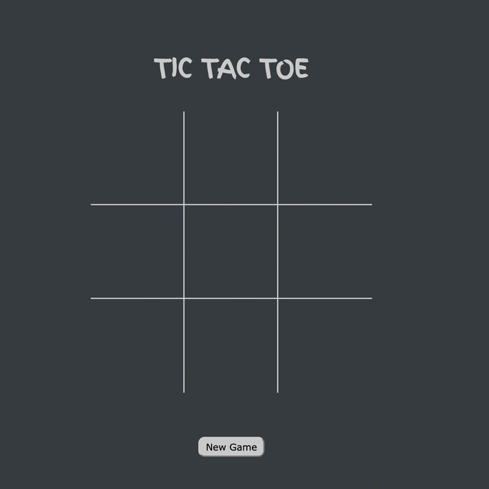
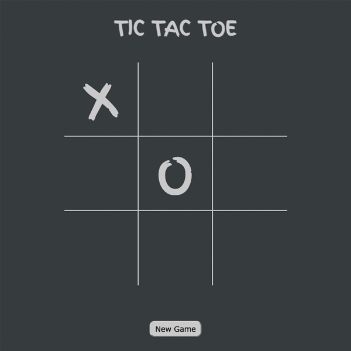
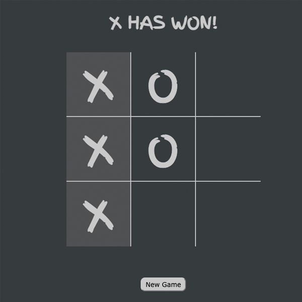
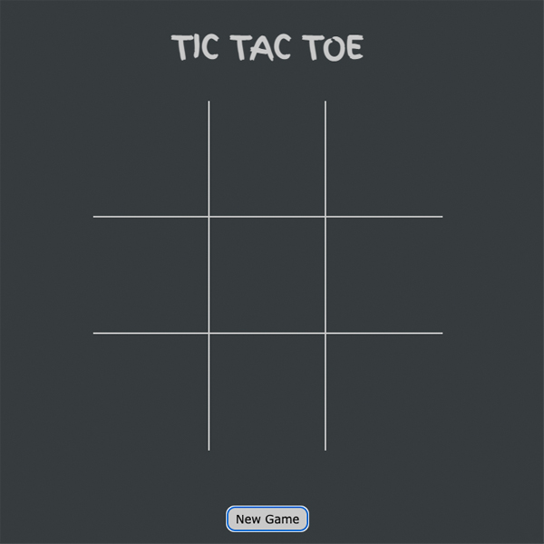

 

## **Welcome to Tic-Tac-Toe**

 

Tic Tac Toe is a two-player game. In this game, there is a board with 3 x 3 squares.

IThe two players take turns putting marks on a 3x3 board. The goal of Tic Tac Toe game is to be one of the players to get three same symbols in a row - horizontally, vertically or diagonally on a 3 x 3 grid. The player who first gets 3 of his/her symbols (marks) in a row - vertically, horizontally, or diagonally wins the game, and the other loses the game. The game can be played by two players.

 

### Game Rules:

A player can choose between two symbols with his opponent, usual game uses “X” and “O”.

The player that gets to play first will get the "X" mark  and the player that gets to play second will get the "O" mark.

Player 1 and 2 take turns making moves with Player 1 playing mark “X” and Player 2 playing mark “O”.

A player marks any of the 3x3 squares with his mark (“X” or “O”) and their aim is to create a straight line horizontally, vertically or diagonally with two intensions:
a. One of the players gets three of his/her marks in a row (vertically, horizontally, or diagonally) i.e. that player wins the game.
b. If no one can create a straight line with their own mark and all the positions on the board are occupied, then the game ends in a draw/tie.

### Implementation Plan:
  

1.The game starts with loading a 3 x 3 grid

 
 
 
2.Player 1 has 1st move and he/she can choose any of them empty boxes, after switch it is Player 2's turn

 
 
 
 
3.Both player has to get 3 in a row to win after which they will be informed which player won. 
 
While taking turn each player should also try and block the other from completely 3 in a row.
 
 
 
 
4.If all boxes are filled and nobody got 3 in a row the game will end in a draw and the board will change to red.

 
  

5.To start a new game and clear the bord the Players can click the New game button.
 
  
 
### Testing:

The website isnt too complex in order to allow all users to browse across different platforms. The game is responsive and can be accessed on mobile, tables and web-browsers.

### Validator Testing:

1. HTML
    -No errors were returned when passing through the official W3C validator https://validator.w3.org/
2. CSS
    -No errors were found when passing through the official (Jigsaw) validator https://jigsaw.w3.org/css-validator/
 

### Deployment:

The site was deployed to GitHub pages. The steps to deplay are as fallows:

        
        - In the GitHub repository, navigate to the settings tab
        - From the source section drop-down menu, select Master Branch
        - Once the master branch has been selected, the page will be automatically refreshed 
        - A detailed ribbon display to indicate the successful deployment.

The live link can be found here - 

### Credits:
This website wouldnt be possible to come to live without the help of the online community.

#### Coding:

* Online coding community and slack was also helpfull with debugging and getting the coding correct.
